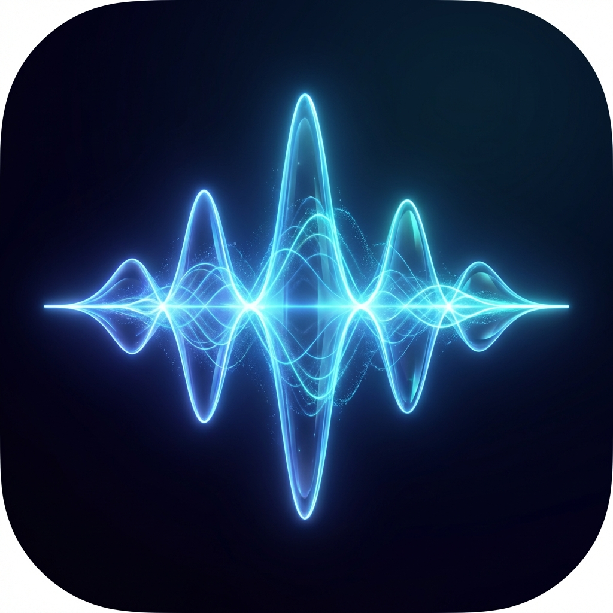

# WavePlayer 🎵

A beautiful, native macOS audio player built with SwiftUI. Features a waveform visualization, multi-playlist management, and optimized for English learning materials.



## Features

### 🎵 Audio Playback
- Play MP3, WAV, AIFF, M4A, and other audio formats
- Waveform visualization with seek functionality
- Playback speed control (0.5x - 2.0x)
- Loop modes: Off, Single Track, All Tracks
- Keyboard shortcuts (Space for play/pause, arrows for seek)

### 📁 Multi-Playlist Management
- Create, rename, and delete playlists
- Drag-to-reorder tracks in Edit mode
- Multi-select and batch delete tracks
- Soft delete with Trash/Restore functionality

### 🎨 Modern UI
- Native macOS design following Human Interface Guidelines
- Dark mode support
- Compact waveform view with track info
- Breadcrumb navigation between playlists and player

### 💾 Persistence
- Playlists saved automatically
- Playback position remembered across sessions
- Security-scoped bookmarks for file access

## Requirements

- macOS 14.0 (Sonoma) or later
- Xcode 15.0 or later

## Building

1. Clone the repository:
   ```bash
   git clone https://github.com/leyle/oh-my-mp3-player.git
   cd oh-my-mp3-player
   ```

2. Open in Xcode:
   ```bash
   open OhMyMP3Player.xcodeproj
   ```

3. Build and run:
   - Select the `OhMyMP3Player` scheme
   - Press `Cmd + R` to build and run

## Usage

### Adding Files
- Click "Add Files" button in a playlist
- Or use `File > Open` menu
- Drag and drop audio files into the window

### Playback Controls
| Shortcut | Action |
|----------|--------|
| `Space` | Play/Pause |
| `←` / `→` | Seek backward/forward 5 seconds |
| `↑` / `↓` | Previous/Next track |

### Edit Mode
1. Open a playlist
2. Click "Edit" button
3. Select multiple tracks with checkboxes
4. Drag to reorder or delete selected

## Project Structure

```
OhMyMP3Player/
├── Models/
│   ├── Track.swift          # Audio track model
│   └── Playlist.swift       # Playlist model
├── ViewModels/
│   └── AudioPlayerViewModel.swift  # Main playback logic
├── Views/
│   ├── ContentView.swift    # Main app layout
│   ├── Player/
│   │   ├── PlayerView.swift     # Player controls
│   │   └── WaveformView.swift   # Waveform visualization
│   └── Sidebar/
│       └── SidebarView.swift    # Playlist navigation
├── Services/
│   ├── AudioService.swift       # AVAudioPlayer wrapper
│   ├── BookmarkManager.swift    # Security-scoped bookmarks
│   ├── MetadataService.swift    # ID3 tag reading
│   ├── PlaylistManager.swift    # Playlist CRUD
│   ├── PersistenceService.swift # User defaults storage
│   └── WaveformGenerator.swift  # Audio waveform extraction
└── LocalMP3PlayerApp.swift      # App entry point
```

## License

MIT License - feel free to use and modify.

## Acknowledgments

Built with ❤️ using SwiftUI and AVFoundation.
